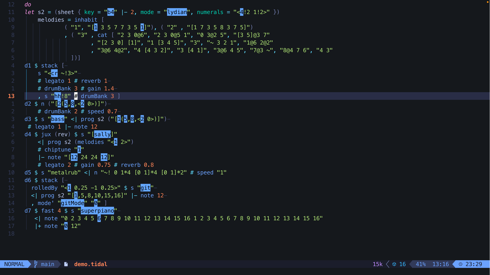

# tidal.nvim

tidal.nvim is (another) Neovim plugin for livecoding with [TidalCycles](https://tidalcycles.org)



See it in action [here](https://www.youtube.com/watch?v=l2IrELGzFpc)

## Features

- User commands to start/stop Tidal and (optionally) SuperCollider processes in
  Neovim's built in terminal (see [boot](#boot))

- Send commands to the Tidal and SuperCollider using built-in [keymaps](#keymaps)

- Write your own keymaps and functions using lua functions exported as part of
  the tidal.nvim [api](#api)

- Apply Haskell syntax highlighting to `.tidal` files

- Event highlighting for the mini notation patterns

- Receive Tidal and SuperCollider responses from stdout and stderr in a separate
  buffer that can be closed and open again

## Installation

Install the plugin with your preferred package manager:

eg [lazy.nvim](https://github.com/folke/lazy.nvim)

```lua
return {
 "thgrund/tidal.nvim",
 opts = {
  -- Your configuration here
  -- See configuration section for defaults
 },
 -- Recommended: Install TreeSitter parsers for Haskell and SuperCollider
 dependencies = {
  "nvim-treesitter/nvim-treesitter",
  opts = { ensure_installed = { "haskell", "supercollider" } },
 },
}
```

## Configuration

```lua
{
  --- Configure TidalLaunch command
  boot = {
    tidal = {
      --- Command to launch ghci with tidal installation
      cmd = "ghci",
      args = {
        "-v0",
      },
      --- Tidal boot file path
      file = "/Users/Your/Path/to/tidalcycles/BootTidal.hs",
      enabled = true,
      highlight = {
        styles = {
          osc = {
            ip = "127.0.0.1",
            port = 3335,
          },
          -- [Tidal ID] -> hl style
          custom = {
            ["drums"] = { bg = "#e7b9ed", foreground = "#000000" },
            ["2"] = { bg = "#b9edc7", foreground = "#000000" },
          },
          global = { baseName = "CodeHighlight", style = { bg = "#7eaefc", foreground = "#000000" } },
        },
        events = {
          osc = {
            ip = "127.0.0.1",
            port = 6013,
          },
        },
        fps = 30,
      },
    },
    sclang = {
      --- Command to launch SuperCollider
      cmd = "sclang",
      args = {},
      --- SuperCollider boot file
      file = vim.api.nvim_get_runtime_file("bootfiles/BootSuperDirt.scd", false)[1],
      enabled = false,
    },
    split = "v",
  },
  --- Default keymaps
  --- Set to false to disable all default mappings
  --- @type table | nil
  mappings = {
    send_line = { mode = { "i", "n" }, key = "<S-CR>" },
    send_visual = { mode = { "x" }, key = "<S-CR>" },
    send_block = { mode = { "i", "n", "x" }, key = "<M-CR>" },
    send_node = { mode = "n", key = "<leader><CR>" },
    send_silence = { mode = "n", key = "<leader>d" },
    send_hush = { mode = "n", key = "<leader><Esc>" },
  },
  ---- Configure highlight applied to selections sent to tidal interpreter
  selection_highlight = {
    --- Highlight definition table
    --- see ':h nvim_set_hl' for details
    --- @type vim.api.keyset.highlight
    highlight = { link = "IncSearch" },
    --- Duration to apply the highlight for
    timeout = 150,
  },
}
```

## Usage

### Boot

`tidal.nvim` provides a of `Ex` commands:

- `:TidalLaunch`: starts the TidalCycles process
- `:TidalQuit`: stops the TidalCycles process
- `:TidalNotification`: This opens a new buffer, that will display the stdout and stderr of the TidalCycles repl session
- `:SuperColliderNotification`: This opens a new buffer, that will display the stdout and stderr of the SuperCollider repl session

By default, only a session of `ghci` running the `BootTidal.hs` script provided by this plugin is run.

If `boot.sclang.enabled` is `true`, then a session of `sclang` is run. Please
ensure that the command `sclang` correctly starts an instance of SuperCollider
when executed in the terminal.

By default on macOS, this may require something like the following shell script
available as `sclang` in your path. Alternate commands/paths can be configured
in `boot.sclang`

```sh
#!/bin/sh
cd /Applications/SuperCollider.app/Contents/MacOS
./sclang "$@"
```

#### Remote backends

Instead of spawning a new `ghci` process, tidal.nvim can connect to an existing
Tidal process over a Unix socket. This is useful when running Tidal outside of
Neovim, e.g. to allow multiple editors to connect to the same Tidal session.

Set `boot.tidal.remote` in your config:

```lua
boot = {
  tidal = {
    remote = {
      --- Path to the Unix domain socket exposed by the running ghci process
      unix = "/tmp/tidal.sock",
      --- Optional: override the starting event ID (important when using
      --- multiple editors to prevent collisions)
      eventIdBase = 0,
    },
  },
},
```

### Keymaps

`tidal.nvim` provides five configurable keymaps in `.tidal` and `.scd` files,
which are used to send chunks of TidalCycles code from the file to the Tidal
and SuperCollider interpreters:

- `send_line` sends the current line

- `send_line` sends a contiguous block of nonempty lines

- `send_node` sends the expression under the cursor

- `send_visual` sends the current visual selection

- `send_silence` accepts a count (see :h count) sends `d<count> silence` to
  tidal, silencing the pattern. By default, with no count, d1 is silenced.

- `hush` sends "hush" to the tidal interpreter, which silences all patterns.

### Autocommands

`tidal.nvim` adds a series of user autocommands which can be used to add custom functionality:

- `TidalLaunch` is executed from the `launch_tidal` function
- `TidalHush` is executed whenever a hush command was received

#### Example: Integrating with scnvim

`scnvim` is a neovim plugin for interacting with supercollider. The `TidalLaunch` autocommand can be used to automatically start `scnvim` whenever Tidal is launched by adding this to your neovim config:

```lua
vim.api.nvim_create_autocmd("User", {
  pattern = "TidalLaunch",
  callback = function()
    require("scnvim").start()

    local bootfile = vim.api.nvim_get_runtime_file("bootfiles/BootSuperDirt.scd", false)[1] -- this needs to be the path to your bootfile, this is the path to the bootfile provided by this plugin

    local file = assert(io.open(bootfile, "r"), "bootfile not found")
    require("scnvim").send(file:read("a"))
  end
})
```

### Event Highlighting

`tidal.nvim` provides the event highlighting for TidalCycles. This plugin was configured
with TidalCycles version >= 1.10.0 in mind. This feature is automatically enabled.

In case you use a custom BootTidal.hs file, you need to add the clock target manually:

```haskell
let clockShape = OSC "/ping" $ Named {requiredArgs = ["clock"]}
let clockTarget = Target {oName = "clock", oAddress = "127.0.0.1", oPort = 6013, oLatency = ((3/10)), oSchedule = Live, oWindow = Nothing, oHandshake = False, oBusPort = Nothing }

tidalInst <- mkTidalWith [(superdirtTarget { oLatency = -0.02 }, [superdirtShape]), (clockTarget, [clockShape])] (defaultConfig {cFrameTimespan = 1/50, cProcessAhead = 1/20})

```

You can customize the event highlighting markers in multiple ways:

1. Change the global style
2. Change the style for each stream id
3. Change the color for each stream id with external osc messages

Where you can edit the styles, you can change any property that is supported by [nvim_set_hl](https://neovim.io/doc/user/api.html#nvim_set_hl()).

#### Change the global style

In your config you can change the global style. The baseName will be applied to all features and has an impact on the osc remote side.

```lua
highlight = {
  styles = {
    global = { baseName = "CodeHighlight", style = { bg = "#7eaefc", foreground = "#000000" } },
  },
},
```

#### Change the style for each stream id

In your config you can define custom styles for every TidalCycles stream. I.e. 1 = d1 and 2 = d2.
But in case you use something like `p "drums" $ s "bd"`, then you can style this as well:

```lua
highlight = {
  styles = {
    custom = {
      ["drums"] = { bg = "#e7b9ed", foreground = "#000000" },
      ["2"] = { bg = "#b9edc7", foreground = "#000000" },
    },
  },
},
```

#### Change the color for each stream id with external osc messages

Right now it's only possible to change the color from the remote source. I choosed to do it this way, to avoid security vulnerabilites and to avoid extra dependencies. You can configure a remote source:

```lua
highlight = {
  styles = {
    osc = {
      ip = "127.0.0.1",
      port = 3335,
    }
  },
},
```

And for example in SuperCollider, you can change the color of a specific stream id like this:

```SuperCollider
  var neoVimOSC = NetAddr("127.0.0.1", 3335);
  neoVimOSC.sendMsg("/neovim/eventhighlighting/addstyle",  "1" , "#e7b9ed");

```

### API

`tidal.nvim` also exposes some useful functions to roll your own keymaps or Ex functions

```lua
-- A daft example of using the tidal.nvim api to make noise
vim.api.nvim_create_user_command("InstantGabber", function()
  local tidal = require("tidal")
  --- Send a message to tidal
  tidal.api.send("setcps (200/60/4)")
  --- Send a multiline message to tidal
  local drums = {
    "d1 $ stack [",
    's "gabba*4" # speed 0.78,',
    's "<[~ sd:2]*4!3 [sd*4 [~ sd]!3]>",',
    's "~ hh:2*4"]',
  }
  tidal.api.send_multiline(drums)
  tidal.api.send('d2 $ "amencutup*8" # irand 32 # crush 4 # speed (5/4)')
  tidal.api.send('d3 $ s "rave" + speed "[3 2 3 2] [4 3 4 2]" # end (slow 2 (tri * 0.7))')
end, { desc = "Make gabber happen fast" })
```

see [api.lua](lua/tidal/api.lua) for the full list

## Requirements

### OS

This plugin has been tested on macOS and Linux.

### TidalCycles

See the [tidal website for full details](https://tidalcycles.org/docs/getting-started/linux_install)

- `ghc` installation with Tidal installed

- SuperCollider with SuperDirt

### Neovim

To use the `send_node` mapping, which is based on
[treesitter](https://github.com/nvim-treesitter/nvim-treesitter), you must have
the treesitter parser for `haskell` (and, optionally also `supercollider`)
installed.

## Contributing

Contributions to this plugin are welcome! If you have ideas, bug fixes, or
enhancements, please submit them as issues or pull requests

## Related projects

- [robbielyman/tidal.nvim](https://github.com/robbielyman/tidal.nvim) - Original
  fork of this project

- [vim.tidal](https://github.com/tidalcycles/vim-tidal) - Vim plugin for
  tidalcycles.

- [vscode-tidalcycles](https://github.com/tidalcycles/vscode-tidalcycles) -
  VSCode plugin for tidalcycles

- [iron.nvim](https://github.com/Vigemus/iron.nvim) - Neovim plugin for sending
  code to various REPLs
